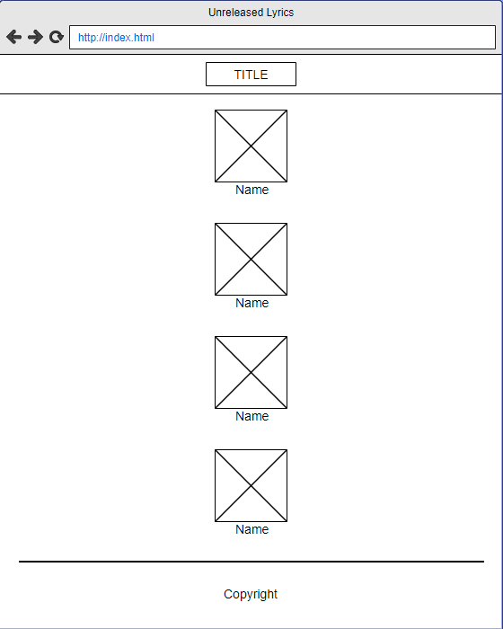
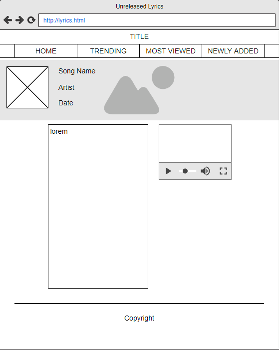

## 1.1.1 Background
The real world problem i attempted to resolve was that of there being no one place or repository for 
unreleased/ fan made Travis Scott songs that also provide correct Lyrics.

## 1.1.2 Wire Frames

This is the wireframe for the home/index page designed for pc primarily.

This is the wireframe for the lyrics pages designed for pc primarily.

## 1.1.3 Colour Choice
the Colour scheme i went for in the index page was, a kind of psychedelic aesthetic. I accomplished this by
incorporating lots of vibrant flashy videos that met also met the aesthetic of astroworld and Travis Scott.

## 1.1.4 Accessibility
I have incororated a form of accessibility within my website by adding alternative tags within my images and/or
videos. This is so that if someone is unable to download or view these files, they can still get an idea of what
should be there.

## 1.2.5 GDPR
I have conformed to the General Data Protection Act by not requesting or using user data, as well as not using
cookies. As a result, the users data is protected.

## 1.2.6 Distance Selling
This website is not an e-commerce website, or is designed to sell or auction goods. Thus, distance selling does
not apply to this website.

## 1.2.7 Evaluation
The problem I tried to solve was there being no one go-to place or repository dedicated to fan made or unreleased
Travis Scott songs that also display the fan made video as well as teh correct lyrics. I have resolved this real
world problem by accomplishing just that.

However, although the website is primarily pc responsive focused, the mobile version for the lyrics pages arent quite
responsive. This is beacuse the video overlaps with the lyrics. I tried to troubleshoot this by using javascript that
allows a user to press a button which will then turn the opacity of the video player to 0.01. By doing this, it allows
the user to listen to the music video, as well as read the lyrics, without them seeing the video ontop of the lyrics.
Consequently, this meant having to change my video player class into an ID, which when doing so, completely broke the
page even though i changed all the correct variables within the html and css cheats to match the new div ID.

I tested the websites responsiveness thorugh th egoogle chrome inspect element tool which can be accessed by pressing
F12, or right clicking anywhere on the page and choosing inspect element. This tool also allows the developer to view
what the website would look like in both a pc version and mobile version as well as having multiple mobile layouts
such as Iphone X or Samsung S5.

My design choices were primarily me wanting to stay away from just a block of text that contained lyrics like 99% of
all other lyric websites have. I also wanted to make it easy for the user to read the lyrics as well, and i did that
by creating gaps between each line and increasing hte font weight. In addition, I wanted the user the feel emersed 
in this hypnotic psychedelic feel when first coming onto the website by constantly sending flashing bright images.
However, a user doesnt want that when viewing lyrics because it will be destracting when trying to read. So, the lyrics
pages gave off a lot more calming feel to them with white and peach colours and added opacity onto the thumbnail.
